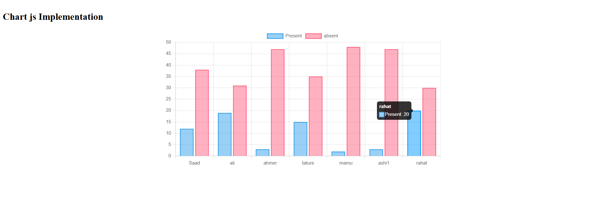

# Chart.js Attendance Visualization

## Overview
This project visualizes student attendance data using **Chart.js**, a JavaScript library for creating beautiful and interactive charts. The bar chart represents the **number of Present and Absent days** for each student in the dataset.

---

## Features
- **Bar Chart Visualization**:
  - **Present** data is displayed as blue bars.
  - **Absent** data is displayed as pink bars.
- Clean, interactive design for easy interpretation of attendance data.

---

## Screenshot


---

## Technologies Used
- **HTML5**: Page structure.
- **CSS3**: Styling for layout and appearance.
- **JavaScript (ES6)**: Logic for rendering the chart.
- **Chart.js**: For creating the bar chart.

---

## Chart Details
- **X-axis**: Student Names (e.g., Saad, Ali, etc.).
- **Y-axis**: Number of days marked as Present or Absent.
- Data categories:
  - **Present (Blue)**: Number of days students were present.
  - **Absent (Pink)**: Number of days students were absent.

---

## How to Use
1. Clone this repository to your local machine:
   ```bash
   git clone https://github.com/saadshiskin/Chart-js-Implementation-in-HTML.git


## Author
#### Developed by **Saad Ali Khan.** 🎓✨